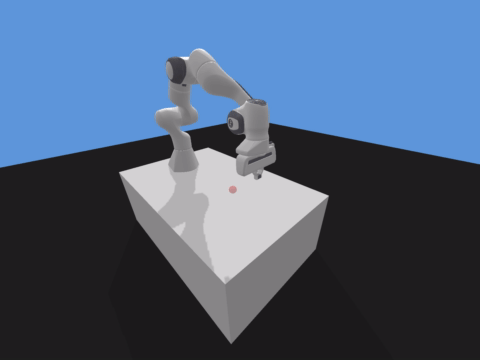
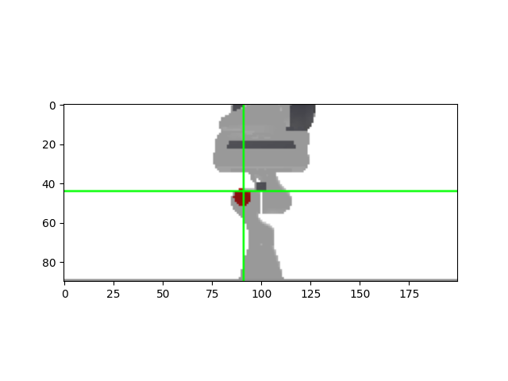
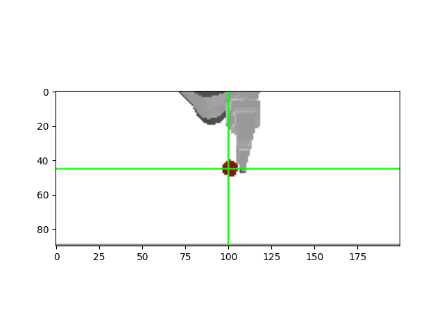

# Photo-based panda gym 

OpenaAI Gym Franka Emika Panda robot environment based on PyBullet.

[](https://pypi.org/project/panda-gym/)
[](https://pepy.tech/project/panda-gym)
[](LICENSE.txt)
[](https://github.com/qgallouedec/panda-gym/actions/workflows/build.yml)
[](https://codecov.io/gh/qgallouedec/panda-gym)
[](https://github.com/psf/black)

## Simulation 
The main goal of learning the robot is to reach the red ball. This is achieved through an iterative learning process. See sample below:

`PandaReach`



## Location of object
In the original implementation, the positions of the ball are retrieved from the environment, while in the following repository, the location of the object is based on two cameras.

`Front`




`Side`



TargetLocator is placed under following path: panda\panda_gym\pybullet.py

### 
## Installation

### Using PyPI

```bash
pip install panda-gym
```

### From source

```bash
git clone https://github.com/qgallouedec/panda-gym.git
pip install -e panda-gym
```

## Usage

Run reach_her.py script in PyCharm (tested on version 2020.2.3)

## Citation for panda lib

Cite as

```
@misc{panda_gym,
  author = {Gallou\'{e}dec, Quentin},
  title = {Multi-goal reinforcement learning environments for Franka Emika Panda robot},
  year = {2021},
  publisher = {GitHub},
  journal = {GitHub repository},
  howpublished = {\url{https://github.com/qgallouedec/panda-gym}},
}
```

Environments are widely inspired from [OpenAI Fetch environments](https://openai.com/blog/ingredients-for-robotics-research/). 
